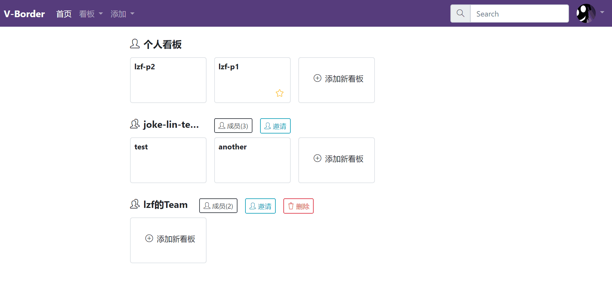
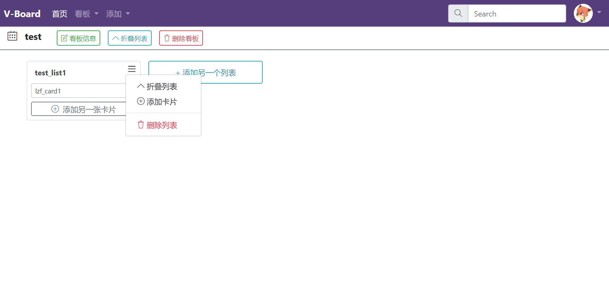
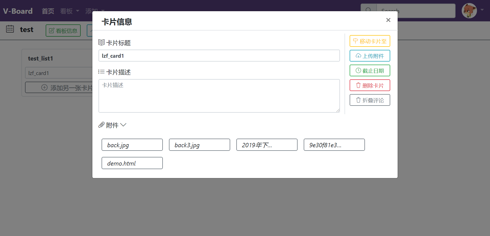
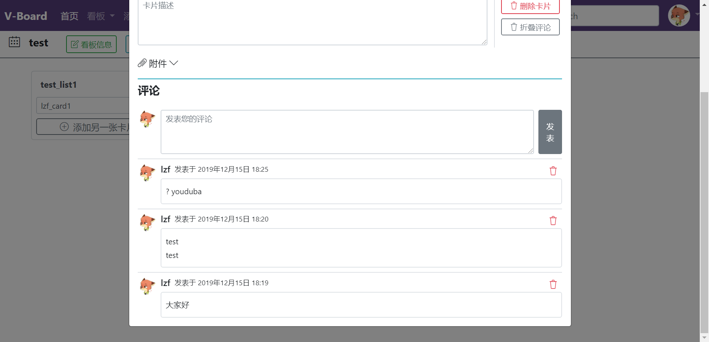

# V-Board: 一站式管理协作平台


## 项目概述

​	V-Board看板是由装满卡片、由你和你的团队使用的各种列表的列表。他核心要素也就只有看板、列表、卡片这三者。从这三个最基础的组件派生出许多有趣且实用的功能。符合大多数用户不同的需求。从个人的日程管理，记录生活琐事，工作计划到团队的项目开发，团队合作都可以提供一种简单有效的管理和记录方式。可以私用或者公用，不论是用作团队协作的进度展示，还是日程管理，V-board都可以完成。

[在线预览（预览最新版本）]( http://101.37.173.44:8000/ )

## 项目结构

```
├─board # 看板页面
│  ├─static
│  ├─templates
├─home # 用户主界面
│  ├─static
│  ├─templates
├─login # 登录界面
│  ├─static
│  ├─templates
├─media # 媒体文件 用户文件
│  ├─attachment
│  └─avatar
├─models # 数据表
├─readmeImgs
├─static # 全局静态文件
│  ├─img
│  └─simple-line-icons
│      ├─css
│      └─fonts
├─templates # 模板文件
└─V_Board
    ├─static
    ├─templates
```

## 开发日志

### 2019-11-8

> 搭建基础框架，配置基础环境，配置Django setting.py (模板、主语言、时区、静态文件等)

#### 配置 Django 模板寻找目录

```python
TEMPLATES = [
    {
        'BACKEND': 'django.template.backends.django.DjangoTemplates',
        'DIRS': [os.path.join(BASE_DIR, 'templates')], # 添加此行增加模板目录
        'APP_DIRS': True,# 使其可以在APP目录下寻找
        'OPTIONS': {
            'context_processors': [
                'django.template.context_processors.debug',
                'django.template.context_processors.request',
                'django.contrib.auth.context_processors.auth',
                'django.contrib.messages.context_processors.messages',
            ],
        },
    },
]
```

#### 配置 Django 静态文件寻找目录

```python
# APP下的静态文件位置
STATIC_URL = '/static/'
# 全局静态文件位置
STATICFILES_DIRS = [os.path.join(BASE_DIR, 'static')]
```

#### 配置 MySQL

> 此处开发需在 MySQL中新建用户 stranger 配置其密码为123456（仅开发使用）
>
> 创建新数据库 v-board 供项目使用

在Django setting.py 中 配置 MySQL为默认数据库

```python
DATABASES = {
    'default': {
        'ENGINE': 'django.db.backends.mysql',
        'NAME': "v-board",
        'USER': "stranger",
        "PASSWORD":'*..*',
        'HOST': 'localhost',
        'PORT': '3306',
    }
}
```

### 2019-11-11

> 配置项目首页，搭建服务器预览设置

####  项目首页配置

配置相关URL设置，以及对应的视图`path('', index)` ：将域名下首页设置为index函数返回的视图

项目首页使用开放模板搭建，遵从相关许可

模板地址:https://github.com/BlackrockDigital/startbootstrap-stylish-portfolio 

#### 服务器搭建

服务器为阿里CentOs 7, python 环境 3.7，数据库为默认 *MariaDB*  (MySQL的子集)

### 2019-11-16

> 实现登陆注册模块

#### 前端页面设置

项目登陆注册页面使用网上的模板

模板地址： http://www.dmaku.com/demo-moban-2071.html 

在此模板基础上添加相应的响应事件以及更改样式

#### 数据库表配置

> 项目未使用 Django 自带的模型，实现原生SQL实现数据库操作
>
> Linux 下 数据库为 MariaDB 5.5.64 需要将编码设置为`utf8_general_ci`

- user_info表：保存用户的个人信息等

	```sql
	CREATE TABLE `user_info` (
		`UID` INT(11) UNSIGNED NOT NULL AUTO_INCREMENT COMMENT '唯一编号',
		`name` VARCHAR(50) NOT NULL COMMENT '用户名',
		`avatar` VARCHAR(100) NOT NULL DEFAULT '' COMMENT '头像路径',
		`description` VARCHAR(500) NOT NULL DEFAULT '' COMMENT '自我描述',
		PRIMARY KEY (`UID`)
	)
	COMMENT='保存用户的个人信息等'
	COLLATE='utf8mb4_0900_ai_ci'
	ENGINE=InnoDB
	AUTO_INCREMENT=1
	;
	```

- user_login表：用户登录信息

	```sql
	CREATE TABLE `user_login` (
		`email` VARCHAR(50) NOT NULL,
		`password` VARCHAR(100) NOT NULL,
		`UID` INT(11) UNSIGNED NOT NULL,
		PRIMARY KEY (`email`),
		INDEX `FK__memberinfo` (`UID`),
		CONSTRAINT `FK__memberinfo` FOREIGN KEY (`UID`) REFERENCES `user_info` (`UID`)
	)
	COMMENT='用户登录信息'
	COLLATE='utf8mb4_0900_ai_ci'
	ENGINE=InnoDB
	;
	```

#### 保持登录状态实现

需要实现用户登录后保持登录状态，HTTP是无状态协议，所以需要使用Django的Session（会话）功能实现

参考： http://www.liujiangblog.com/course/django/111 

#### 后端逻辑代码

新建APP：login实现登录注册功能

### 2019-11-23

> 用户登录后主页的前端界面搭建

#### 用户界面功能

- 添加看板
- 添加团队
- 修改个人信息
- 显示用户个人看板以及所属团队看板（暂无星标看板以及历史看板）
- 搜索框
- 登出
- 点击星星可改变收藏状态（仅前端）

#### 项目结构修改

新建home APP 处理用户主界面的相关逻辑（目前只有前端）

项目根目录下添加相关前端模板（templates）和JS、CSS（static）

### 2019-12-2

#### 当前效果预览



#### 添加功能

> 将上次的功能后端实现，并且添加以下功能：

- 看板删除
- 团队删除
- 团队成员删除

#### 数据库添加

1. Team:

	```sql
	CREATE TABLE `team` (
		`TID` INT(10) UNSIGNED NOT NULL AUTO_INCREMENT COMMENT '团队唯一标识',
		`name` VARCHAR(50) NOT NULL COMMENT '团队名字',
		`UID` INT(11) UNSIGNED NOT NULL COMMENT '外键指向用户 表示所属',
		PRIMARY KEY (`TID`),
		INDEX `FK__usr_info` (`UID`),
		CONSTRAINT `FK__usr_info` FOREIGN KEY (`UID`) REFERENCES `user_info` (`UID`) ON UPDATE CASCADE ON DELETE CASCADE
	)
	COMMENT='记录团队信息'
	COLLATE='utf8mb4_0900_ai_ci'
	ENGINE=InnoDB
	;
	```

2. Team_Member:

	```sql
	CREATE TABLE `team_member` (
		`TID` INT(10) UNSIGNED NOT NULL COMMENT '外键',
		`UID` INT(10) UNSIGNED NOT NULL COMMENT '外键',
		PRIMARY KEY (`TID`, `UID`),
		INDEX `FK_team_member_usr_info` (`UID`),
		CONSTRAINT `FK_team_member_team` FOREIGN KEY (`TID`) REFERENCES `team` (`TID`) ON UPDATE CASCADE ON DELETE CASCADE,
		CONSTRAINT `FK_team_member_usr_info` FOREIGN KEY (`UID`) REFERENCES `user_info` (`UID`) ON UPDATE CASCADE ON DELETE CASCADE
	)
	COMMENT='团队成员表'
	COLLATE='utf8mb4_0900_ai_ci'
	ENGINE=InnoDB
	;
	```

3. Personal_Board:

	```sql
	CREATE TABLE `personal_board` (
		`BID` INT(10) UNSIGNED NOT NULL AUTO_INCREMENT COMMENT '个人看板编号',
		`name` VARCHAR(50) NOT NULL COMMENT '看板名字',
		`description` VARCHAR(500) NOT NULL DEFAULT '' COMMENT '看板描述',
		`UID` INT(10) UNSIGNED NOT NULL COMMENT '所有者编号',
		`is_public` TINYINT(1) NULL DEFAULT '0',
		`is_star` TINYINT(1) NULL DEFAULT '0',
		`time` TIMESTAMP NULL DEFAULT NULL,
		PRIMARY KEY (`BID`),
		INDEX `FK__board_usr_info` (`UID`),
		CONSTRAINT `FK__board_usr_info` FOREIGN KEY (`UID`) REFERENCES `user_info` (`UID`) ON UPDATE CASCADE ON DELETE CASCADE
	)
	COMMENT='personal_board: (BID, name, description, uid)'
	COLLATE='utf8mb4_0900_ai_ci'
	ENGINE=InnoDB
	AUTO_INCREMENT=1
	;
	```

4. Team_Board:

	```sql
	CREATE TABLE `team_board` (
		`BID` INT(10) UNSIGNED NOT NULL AUTO_INCREMENT,
		`name` VARCHAR(50) NOT NULL,
		`description` VARCHAR(500) NOT NULL DEFAULT '',
		`TID` INT(10) UNSIGNED NOT NULL,
		`is_public` TINYINT(1) NULL DEFAULT '0',
		`is_star` TINYINT(1) NULL DEFAULT '0',
		`time` TIMESTAMP NULL DEFAULT NULL,
		PRIMARY KEY (`BID`),
		INDEX `FK__team_board_team` (`TID`),
		CONSTRAINT `FK__team_board_team` FOREIGN KEY (`TID`) REFERENCES `team` (`TID`) ON UPDATE CASCADE ON DELETE CASCADE
	)
	COMMENT='团队看板'
	COLLATE='utf8mb4_0900_ai_ci'
	ENGINE=InnoDB
	;
	```

### 2019-12-15

> 第一个可使用完整版本
>
> - 看板主界面完成
> - 列表卡片创建：创建权限无限制，删除只能管理者
> - 评论功能：团队管理者和属主可以删除
> - 附件功能：同上
>
> 待完成功能：
>
> - 看板&卡片转移
> - 定时
> - 忘记密码

#### 看板主界面效果



#### 附件



#### 评论



#### 数据库配置

> 因为看板分为个人和团队 所以之后所有表都分为个人和团队两部分 
>
> 个人表只需要将表名第一个字母变为P， 外键配置为相应的个人或者团队表的对应键值

##### 列表

团队：

```sql
CREATE TABLE `t_list` (
	`LID` INT(10) UNSIGNED NOT NULL AUTO_INCREMENT,
	`name` VARCHAR(50) NOT NULL,
	`BID` INT(10) UNSIGNED NOT NULL COMMENT '指向团队看板ID',
	`UID` INT(10) UNSIGNED NOT NULL,
	PRIMARY KEY (`LID`),
	INDEX `FK__team_board` (`BID`),
	INDEX `FK_t_list_user_info` (`UID`),
	CONSTRAINT `FK__team_board` FOREIGN KEY (`BID`) REFERENCES `team_board` (`BID`) ON UPDATE CASCADE ON DELETE CASCADE,
	CONSTRAINT `FK_t_list_user_info` FOREIGN KEY (`UID`) REFERENCES `user_info` (`UID`) ON UPDATE CASCADE ON DELETE CASCADE
)
COMMENT='指向团队看板的列表'
COLLATE='utf8mb4_0900_ai_ci'
ENGINE=InnoDB
AUTO_INCREMENT=1
;
```

个人：

```sql
CREATE TABLE `p_list` (
	`LID` INT(10) UNSIGNED NOT NULL AUTO_INCREMENT,
	`name` VARCHAR(50) NOT NULL,
	`BID` INT(10) UNSIGNED NOT NULL COMMENT '指向personal_board',
	`UID` INT(10) UNSIGNED NOT NULL,
	PRIMARY KEY (`LID`),
	INDEX `FK__personal_board` (`BID`),
	INDEX `FK_p_list_user_info` (`UID`),
	CONSTRAINT `FK__personal_board` FOREIGN KEY (`BID`) REFERENCES `personal_board` (`BID`) ON UPDATE CASCADE ON DELETE CASCADE,
	CONSTRAINT `FK_p_list_user_info` FOREIGN KEY (`UID`) REFERENCES `user_info` (`UID`) ON UPDATE CASCADE ON DELETE CASCADE
)
COMMENT='个人list指向一个PersonBoard'
COLLATE='utf8mb4_0900_ai_ci'
ENGINE=InnoDB
AUTO_INCREMENT=1
;
```

##### 卡片

团队：

```sql
CREATE TABLE `t_card` (
	`CID` INT(10) UNSIGNED NOT NULL AUTO_INCREMENT,
	`LID` INT(10) UNSIGNED NOT NULL,
	`name` VARCHAR(50) NOT NULL,
	`description` VARCHAR(500) NOT NULL DEFAULT '',
	`due_time` TIMESTAMP NULL DEFAULT NULL,
	`UID` INT(10) UNSIGNED NOT NULL,
	PRIMARY KEY (`CID`),
	INDEX `FK__t_list` (`LID`),
	INDEX `FK_t_card_user_info` (`UID`),
	CONSTRAINT `FK__t_list` FOREIGN KEY (`LID`) REFERENCES `t_list` (`LID`) ON UPDATE CASCADE ON DELETE CASCADE,
	CONSTRAINT `FK_t_card_user_info` FOREIGN KEY (`UID`) REFERENCES `user_info` (`UID`) ON UPDATE CASCADE ON DELETE CASCADE
)
COMMENT='指向团队列表的卡片'
COLLATE='utf8mb4_0900_ai_ci'
ENGINE=InnoDB
AUTO_INCREMENT=1
;
```

个人：

```sql
CREATE TABLE `p_card` (
	`CID` INT(10) UNSIGNED NOT NULL AUTO_INCREMENT,
	`name` VARCHAR(50) NOT NULL DEFAULT '',
	`description` VARCHAR(50) NOT NULL DEFAULT '',
	`LID` INT(10) UNSIGNED NOT NULL,
	`due_time` TIMESTAMP NULL DEFAULT NULL,
	`UID` INT(10) UNSIGNED NOT NULL,
	PRIMARY KEY (`CID`),
	INDEX `FK__p_list` (`LID`),
	INDEX `FK_p_card_user_info` (`UID`),
	CONSTRAINT `FK__p_list` FOREIGN KEY (`LID`) REFERENCES `p_list` (`LID`) ON UPDATE CASCADE ON DELETE CASCADE,
	CONSTRAINT `FK_p_card_user_info` FOREIGN KEY (`UID`) REFERENCES `user_info` (`UID`) ON UPDATE CASCADE ON DELETE CASCADE
)
COMMENT='指向个人列表的卡片'
COLLATE='utf8mb4_0900_ai_ci'
ENGINE=InnoDB
AUTO_INCREMENT=1
;
```

##### 附件

团队:

```sql
CREATE TABLE `t_attachment` (
	`FID` INT(10) UNSIGNED NOT NULL AUTO_INCREMENT,
	`path` VARCHAR(100) NOT NULL,
	`CID` INT(10) UNSIGNED NOT NULL,
	`UID` INT(10) UNSIGNED NOT NULL,
	PRIMARY KEY (`FID`),
	INDEX `FK__t_card` (`CID`),
	INDEX `FK_t_attachment_user_info` (`UID`),
	CONSTRAINT `FK__t_card` FOREIGN KEY (`CID`) REFERENCES `t_card` (`CID`) ON UPDATE CASCADE ON DELETE CASCADE,
	CONSTRAINT `FK_t_attachment_user_info` FOREIGN KEY (`UID`) REFERENCES `user_info` (`UID`) ON UPDATE CASCADE ON DELETE CASCADE
)
COMMENT='团队类型的附件'
COLLATE='utf8mb4_0900_ai_ci'
ENGINE=InnoDB
AUTO_INCREMENT=1
;
```

个人：

```sql
CREATE TABLE `p_attachment` (
	`FID` INT(10) UNSIGNED NOT NULL AUTO_INCREMENT,
	`path` VARCHAR(100) NOT NULL,
	`CID` INT(10) UNSIGNED NOT NULL,
	`UID` INT(10) UNSIGNED NOT NULL,
	PRIMARY KEY (`FID`),
	INDEX `FK__p_card` (`CID`),
	INDEX `FK_p_attachment_user_info` (`UID`),
	CONSTRAINT `FK__p_card` FOREIGN KEY (`CID`) REFERENCES `p_card` (`CID`) ON UPDATE CASCADE ON DELETE CASCADE,
	CONSTRAINT `FK_p_attachment_user_info` FOREIGN KEY (`UID`) REFERENCES `user_info` (`UID`) ON UPDATE CASCADE ON DELETE CASCADE
)
COMMENT='附件'
COLLATE='utf8mb4_0900_ai_ci'
ENGINE=InnoDB
AUTO_INCREMENT=1
;
```

##### 评论

团队：

```sql
CREATE TABLE `t_comment` (
	`cm_id` INT(10) UNSIGNED NOT NULL AUTO_INCREMENT,
	`val` VARCHAR(500) NOT NULL,
	`UID` INT(11) UNSIGNED NOT NULL,
	`CID` INT(11) UNSIGNED NOT NULL,
	`time` TIMESTAMP NOT NULL DEFAULT CURRENT_TIMESTAMP,
	PRIMARY KEY (`cm_id`),
	INDEX `FK_t_comment_user_info` (`UID`),
	INDEX `FK_t_comment_t_card` (`CID`),
	CONSTRAINT `FK_t_comment_t_card` FOREIGN KEY (`CID`) REFERENCES `t_card` (`CID`) ON UPDATE CASCADE ON DELETE CASCADE,
	CONSTRAINT `FK_t_comment_user_info` FOREIGN KEY (`UID`) REFERENCES `user_info` (`UID`) ON UPDATE CASCADE ON DELETE CASCADE
)
COLLATE='utf8mb4_0900_ai_ci'
ENGINE=InnoDB
AUTO_INCREMENT=1
;
```

个人：

```sql
CREATE TABLE `p_comment` (
	`cm_id` INT(10) UNSIGNED NOT NULL AUTO_INCREMENT,
	`val` VARCHAR(500) NOT NULL,
	`UID` INT(10) UNSIGNED NOT NULL,
	`CID` INT(10) UNSIGNED NOT NULL,
	`time` TIMESTAMP NOT NULL DEFAULT CURRENT_TIMESTAMP,
	PRIMARY KEY (`cm_id`),
	INDEX `FK__p_comment_user_info` (`UID`),
	INDEX `FK__p_comment_p_card` (`CID`),
	CONSTRAINT `FK__p_comment_p_card` FOREIGN KEY (`CID`) REFERENCES `p_card` (`CID`) ON UPDATE CASCADE ON DELETE CASCADE,
	CONSTRAINT `FK__p_comment_user_info` FOREIGN KEY (`UID`) REFERENCES `user_info` (`UID`) ON UPDATE CASCADE ON DELETE CASCADE
)
COMMENT='个人评论'
COLLATE='utf8mb4_0900_ai_ci'
ENGINE=InnoDB
AUTO_INCREMENT=1
;
```

